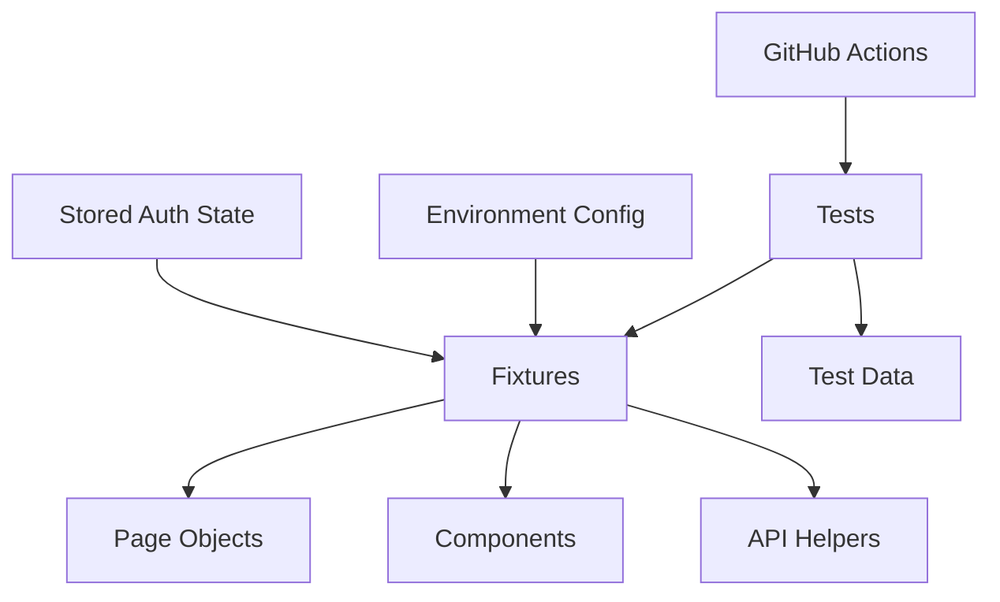

# Playwright Enterprise Framework

A production-style **Playwright + TypeScript** automation framework focused on reusable architecture, test reliability, CI/CD integration and maintainable engineering practices.

This repository is intentionally framework-first. It demonstrates how a scalable browser automation codebase can be organized for an enterprise QA/SDET team.

## Core capabilities

- Playwright + TypeScript
- Reusable fixtures
- Page Object Model
- Reusable component objects
- Authentication state reuse
- Multi-environment configuration
- Smoke/regression tagging
- Parallel execution
- API setup/cleanup patterns
- Screenshots, video and traces
- HTML reporting
- Cross-browser support
- Docker execution
- GitHub Actions
- Synthetic test data

## Demo application

The starter tests use SauceDemo:

```text
https://www.saucedemo.com
```

This keeps the repository runnable without proprietary systems.

## Architecture



## Project structure

```text
playwright-enterprise-framework/
├── .github/workflows/
├── config/
├── data/
├── docs/
├── fixtures/
├── pages/
├── components/
├── tests/
│   ├── smoke/
│   ├── regression/
│   └── api/
├── scripts/
├── Dockerfile
├── docker-compose.yml
├── playwright.config.ts
├── package.json
└── README.md
```

## Setup

```bash
npm install
npx playwright install
cp .env.example .env
```

## Run tests

```bash
npm test
npm run test:smoke
npm run test:regression
npm run test:chromium
npm run test:firefox
npm run test:webkit
```

## Debugging

```bash
npm run test:headed
npm run test:debug
npx playwright show-report
```

## Docker

```bash
docker compose build
docker compose run --rm tests
```

## Enterprise design goals

- Tests should be readable
- Tests should be independent
- Test data should be synthetic
- Setup should avoid slow UI flows where possible
- Reusable UI should live in components
- Failures should be diagnosable from CI artifacts
- Environment-specific values should not be hard-coded

## Confidentiality

This is an independently developed portfolio project using public demo software and synthetic data. It contains no employer code, private automation framework, internal test cases, production credentials, customer data or proprietary business rules.
